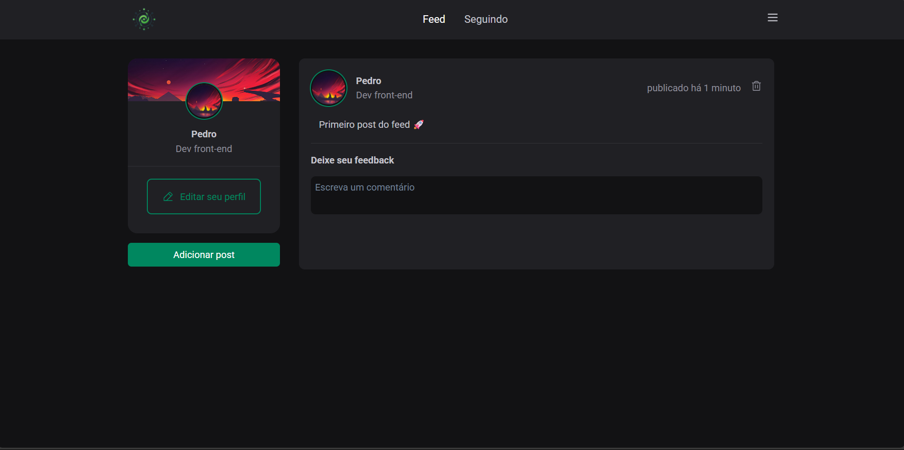

<h1 align='center'>
    Feed
    <br />
    <br />
    
</h1>
<br />

## Projeto 🎯
Desenvolvi o [Feed](https://feed-pdd.vercel.app) com objetivo de aprendizado, pois queria ver se seria capaz de fazer um projeto maior. O código não está muito limpo, porém o resultado final até que ficou interessante.

## Tecnologias 🧪
O Feed foi desenvolovido com as seguintes tecnologias:

- [React](https://react.dev/)
- [Typescript](https://www.typescriptlang.org/)
- [Chakra UI](https://www.chakra-ui.com/)
- [Firebase](https://firebase.google.com/)

## Como executar 
Para executar o projeto localmente, siga os seguintes passos:

```bash
$ git clone https://github.com/pdanmt/Feed

$ cd Feed
```
Para inicializar o projeto, utilize o npm:
```bash
# Instale as dependências
$ npm i

$ npm run dev
```
A aplicação será aberta no seu navegador padrão no endereço http://localhost:3000, caso a porta 3000 não esteja sendo utilizada.

Além disso, será necessário que você crie um projeto firebase, utilizando do firebase firestore e authentication. Após isso, crie um arquivo .env.local ou .env na raiz do projeto e coloque as configurações do firebase, deste jeito:

```bash
VITE_API_KEY=<SUA_CHAVE>
VITE_AUTH_DOMAIN=<SEU_DOMÍNIO_DE_AUTENTICAÇÃO>
VITE_DATABASE_URL=<A_URL_DO_SEU_BANCO_DE_DADOS>
VITE_PROJECT_ID=<O_ID_DO_SEU_PROJETO>
VITE_STORAGE_BUCKET=<SEU_STORAGE_BUCKET>
VITE_MESSAGING_SENDER_ID=<SEU_MESSAGING_SENDER_ID>
VITE_APP_ID=<O_ID_DA_SUA_APLICAÇÃO>
```

## Layout 📝

O design do Feed foi parcialmente desenvolvido pelo pessoal da [Rocketseat](https://www.rocketseat.com.br) e pode ser acessado no seguinte link:
[Figma do projeto](https://www.figma.com/community/file/1113573231685349036/ignite-feed)

---